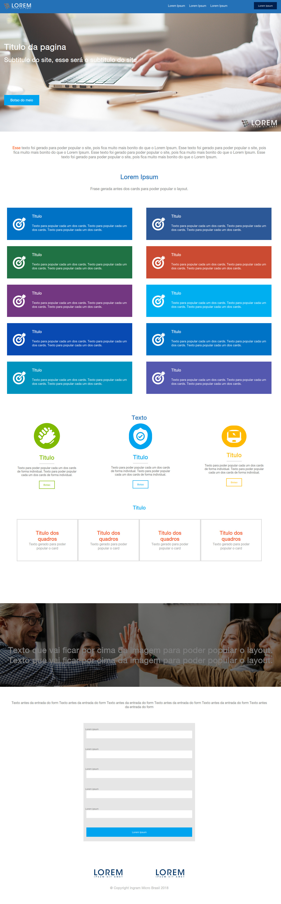
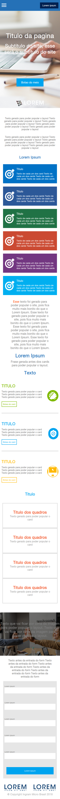

<h1 align="center">Bem vindo ao Desafio Raccon👋</h1>
<p>
  
  <a href="LICENSE" target="_blank">
    
  </a>
  <a href="https://twitter.com/andersonarorjdev" target="_blank">
    
  </a>
</p>


<h4>Projeto desenvolvido com o intuíto de copiar o layout proposto,🌝 Uma ótima oportunidade em se aplicar a metodolia pixel perfect e mobile first.🤔</h4>

 
> Esse foi um desafio que eu com toda certeza amei, pois pude treinar muito minhas habilidades com FlexBox, Css-Grid, responsividade utilizando media queries, experimentos com o Javascript manipulando a API do DOM.🚀
> Desenvolvendo esse desafio, eu aprendi a desenvolver coisas que eram simples de se fazer com Frameworks, como por exemple: Bootstrap e eu não fazia idéia de como isso poderia ser desenvolvido de forma pura.🙋

!PS:Esse README foi desenvolvido em Portuguẽs, tendo em vista que o avaliador prefira a interpretação nesse idioma.!
#####  Aprendi muito com esse desafio e consegui experimentar coisas novas.💘

<p  align="center">
    
</p>

<p  align="center">
    
</p>

***

## Baixando o projeto.
```sh
  git clone https://github.com/andersonarorjdev/Desafio-Raccon.git
```

## Para visualizar o projeto, acesse o arquivo "Index.html" a partir do seu navegador.

```sh
C://User/Downloads/Desafio-Raccon/index.html
``` 
#### Exemplo hipotético e que pode mudar de acordo com a estrutura de pastas que você tiver.

## Author

👤 **Andersonarorjdev**

* Website: https://andersonarorjdev.github.io
* Twitter: [@andersonarorjdev](https://twitter.com/andersonarorjdev)
* Github: [@andersonarorjdev](https://github.com/andersonarorjdev)
* LinkedIn: [@andersonarorjdev](https://linkedin.com/in/andersonarorjdev)

## Show your support

Give a ⭐️ if this project helped you!

## 📝 License

Copyright © 2020 [Andersonarorjdev](https://github.com/andersonarorjdev).<br />
This project is [MIT](LICENSE) licensed.

